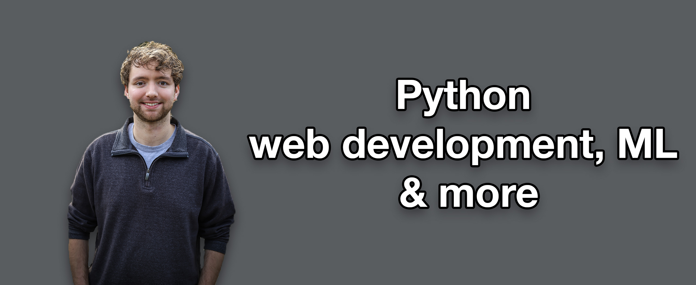

### Hi there, I'm Caleb! 🍛

- 💰 Sponsor me on [GitHub](https://github.com/sponsors/CalebCurry)
- 🎥 Watch my tutorials on [YouTube](https://www.youtube.com/calebthevideomaker2)
- 📗 My courses on [CodeBreakthrough](https://www.codebreakthrough.com)
- 🤔 I’m currently studying: [Python](https://www.youtube.com/watch?v=s3IvdkCq2_c&t=4254s)

### Latest YouTube Videos
<!-- YOUTUBE:START -->
- [C and C++ 20 Week Bootcamp Open Now! #code #bootcamp](https://www.youtube.com/watch?v=MvbPQ-alj8Q)
- [NEW COURSE! C and C++ Mastery Bootcamp](https://www.youtube.com/watch?v=n40T0zZcEdQ)
- [3 C++ Pitfalls to Avoid](https://www.youtube.com/watch?v=IF5D_NQqgrs)
- [Writing Code with AI in VSCode &lpar;GitHub Copilot&rpar;](https://www.youtube.com/watch?v=-UylboAAk8g)
- [Why you&#39;re not happy with your life](https://www.youtube.com/watch?v=R28rJm7_uVk)
<!-- YOUTUBE:END -->
